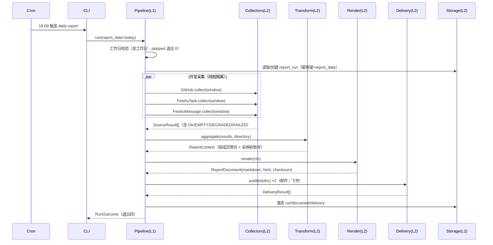

# 智能日报生成器 · 系统架构设计

> 上游需求：`specs/proposal.md`
> 文档状态：待评审 ｜ 版本：v1.0 ｜ 适用范围：本期（MVP）

---

## 0. 设计摘要

| 项 | 结论 |
| --- | --- |
| 形态 | 单体批处理 CLI 应用，Cron 定时触发，无常驻进程、无 Web 服务 |
| 语言/运行时 | Python 3.11+，`uv` 管理依赖，Docker 容器化部署在内网服务器 |
| 核心流程 | 采集 → 归一 → 按人聚合 → 渲染 → 投递 → 落库 |
| 数据源 | GitHub（Commits）、飞书项目（任务流转）、飞书群消息（讨论摘要） |
| 产出 | Markdown（唯一真源）+ 由其转换的 HTML |
| 投递 | SMTP 邮件（Leader，HTML）＋ 飞书机器人（群组，Markdown） |
| 存储 | 本地 SQLite（WAL），仅存日报历史与投递记录 |
| 关键非功能 | 单源失败隔离与显式降级标注、60s 性能预算、凭据零落盘 |

---

## 1. 架构总览

### 1.1 设计原则

| 编号 | 原则 | 在本文的落地方式 |
| --- | --- | --- |
| P1 | **失败可见** | 任何数据源失败必须在日报正文显著位置标注，禁止静默跳过（对应验收 3.2） |
| P2 | **单源隔离** | 采集器之间无共享状态，任一采集器异常不阻断其他采集器与后续流程 |
| P3 | **边界收敛** | 外部 API 只出现在 `collectors/` 与 `delivery/` 适配层，领域层不感知 HTTP |
| P4 | **无 AI 依赖** | 报告内容由模板与规则生成，不调用任何 LLM（对应 2.2 范围排除） |
| P5 | **显式契约** | 模块间只通过 `models/` 中定义的数据结构交互，禁止透传第三方 SDK 的原始字典 |
| P6 | **可重入** | 同一天重复执行结果一致且不重复投递，便于人工补跑 |
| P7 | **配置即代码** | 成员映射、关键词、节假日等全部配置化，代码中无硬编码业务数据 |

### 1.2 分层视图

```
┌──────────────────────────────────────────────────────────────┐
│ L0 入口层      cli/            cron entrypoint                │
│                (report run / report preview / member check)   │
├──────────────────────────────────────────────────────────────┤
│ L1 编排层      orchestrator/   流水线编排、并发调度、降级汇总   │
├──────────────────────────────────────────────────────────────┤
│ L2 能力层                                                     │
│   collectors/   transform/    render/    delivery/   storage/ │
│   (采集)        (聚合归一)     (渲染)     (投递)      (持久化) │
│   calendar/     identity/                                     │
│   (工作日)      (成员映射)                                     │
├──────────────────────────────────────────────────────────────┤
│ L3 支撑层                                                     │
│   config/  http/  resilience/  logging/  secrets/             │
│   (配置)   (HTTP)  (重试限流)   (日志)    (凭据)               │
└──────────────────────────────────────────────────────────────┘
```

依赖方向严格自上而下：L0 → L1 → L2 → L3，反向依赖禁止（L3 不得 import L2）。

### 1.3 运行时时序（正常路径）



### 1.4 目录结构

```
daily_report/
├── cli.py                    # argparse 入口与退出码映射
├── config/
│   ├── settings.py           # pydantic-settings，环境变量→强类型配置
│   ├── members.yaml          # 成员 GitHub↔飞书↔邮件 映射
│   └── holidays.yaml         # 法定节假日/调休配置
├── orchestrator/
│   ├── pipeline.py           # 主流程编排
│   └── outcome.py            # RunOutcome / 退出码
├── collectors/
│   ├── base.py               # Collector Protocol + CollectContext
│   ├── github.py             # GitHub Commits
│   ├── feishu_task.py        # 飞书项目任务流转
│   ├── feishu_message.py     # 飞书群消息
│   └── registry.py           # 名称→采集器 注册与装配
├── identity/
│   └── directory.py          # MemberDirectory：外部账号→成员归一
├── transform/
│   └── aggregator.py         # SourceResult[] → ReportContext
├── render/
│   ├── markdown.py           # Jinja2 三段式模板
│   ├── html.py               # Markdown→HTML（净化 + 内联样式）
│   └── templates/
│       ├── report.md.j2
│       └── mail.css
├── delivery/
│   ├── base.py               # Publisher Protocol
│   ├── email.py              # SMTP
│   └── feishu_bot.py         # 飞书自定义机器人 Webhook
├── storage/
│   ├── schema.sql            # DDL
│   └── repository.py         # SQLite 数据访问（参数化 SQL）
├── calendar/
│   └── workday.py            # WorkdayCalendar：周末 + 节假日 + 调休
├── http/
│   └── client.py             # httpx 封装：超时/连接池/结构化异常
├── resilience/
│   ├── retry.py              # 指数退避重试
│   └── ratelimit.py          # 限流感知与 Token 轮换/刷新
├── logging/
│   └── setup.py              # 结构化 JSON 日志 + 脱敏
└── models/
    ├── domain.py             # 领域模型（dataclass）
    └── enums.py
```

---

## 2. 模块划分与职责定义

### 2.1 模块清单

| # | 模块 | 层 | 主要职责 | 不负责（明确边界） |
| --- | --- | --- | --- | --- |
| M1 | `cli` | L0 | 解析命令与参数（`run/preview/doctor`）、装配依赖、映射进程退出码 | 不含业务规则 |
| M2 | `config.settings` | L3 | 从环境变量加载强类型配置，启动时 fail-fast 校验必填项与格式 | 不读取业务数据（成员/节假日） |
| M3 | `calendar.workday` | L2 | 判断日期是否为工作日（周末 + 节假日 + 调休补班） | 不负责时区转换（由 `clock` 统一） |
| M4 | `collectors.github` | L2 | 拉取采集窗口内指定仓库的 Commit 列表与变更统计 | 不做成员映射、不去重跨仓库冲突 |
| M5 | `collectors.feishu_task` | L2 | 拉取当日发生状态流转的任务事件 | 不判断是否"有意义"，只做状态过滤 |
| M6 | `collectors.feishu_message` | L2 | 拉取群消息，按关键词命中提取讨论摘要 | 不做语义理解/摘要 |
| M7 | `collectors.base/registry` | L2 | 定义采集器统一契约、超时与异常捕获、装配清单 | 不做结果合并 |
| M8 | `identity.directory` | L2 | 外部账号（`github_login` / `feishu_open_id`）→ 成员的归一映射，输出未映射清单 | 不发起外部请求 |
| M9 | `transform.aggregator` | L2 | 按成员聚合三类记录、排序去重、识别空数据成员 | 不做格式化与渲染 |
| M10 | `render.markdown` | L2 | 按"代码→任务进展→协作沟通"三段式生成 Markdown，含降级警示块 | 不调用任何 AI 服务 |
| M11 | `render.html` | L2 | Markdown→HTML、HTML 净化、内联 CSS，产出邮件正文 | 不发送邮件 |
| M12 | `delivery.email` | L2 | SMTP 发送 HTML 日报给 Leader 收件组 | 不渲染内容 |
| M13 | `delivery.feishu_bot` | L2 | 飞书机器人 Webhook 推送 Markdown 日报到群 | 不做采集 |
| M14 | `storage.repository` | L2 | SQLite 读写：运行记录、日报正文、投递记录；幂等与重跑覆盖 | 不做业务判断 |
| M15 | `orchestrator.pipeline` | L1 | 串接全流程：工作日校验→并发采集→聚合→渲染→投递→落库→汇总 | 不直接访问外部 API |
| M16 | `http.client` | L3 | httpx 封装：超时、连接池、状态码→结构化异常、Token 注入 | 不含业务语义 |
| M17 | `resilience.retry/ratelimit` | L3 | 重试退避、限流探测、GitHub Token 轮换/刷新与冷却 | 不感知具体接口 |
| M18 | `logging.setup` | L3 | 结构化 JSON 日志、敏感字段脱敏、耗时埋点 | 不做告警动作 |

### 2.2 关键模块职责详述

#### M1 `cli`（入口层）

| 子命令 | 用途 | 说明 |
| --- | --- | --- |
| `run` | 正式执行当日日报 | Cron 调用；含工作日校验与落库 |
| `run --date YYYY-MM-DD --force` | 人工补跑指定日期 | `--force` 覆盖已完成投递的幂等保护 |
| `preview` | 仅渲染输出到 stdout，不投递不落库 | 用于模板与数据调试 |
| `doctor` | 连通性自检：校验配置、各数据源 Token、SMTP、Webhook | 部署验收与故障排查 |

#### M7 `collectors.base`（采集器契约）

* 统一 `Collector` 协议，所有采集器必须**在自身内部消化异常**，任何情况下返回 `SourceResult`，绝不允许异常逃逸到编排层。
* 采集窗口由编排层统一下发，采集器不得自行计算"今日"。
* 单个采集器必须遵守超时预算（见 §6.3），超时即降级为 `FAILED/DEGRADED`。

#### M8 `identity.directory`（成员归一）

* 唯一权威：`config/members.yaml`，键为 `member.id`。
* 提供双向索引：`github_login → Member`、`feishu_open_id → Member`。
* 采集结果中无法映射的账号进入 `ReportContext.unmapped_authors`，在日报附录中提示（避免数据丢失且便于运维修正映射）。

#### M9 `transform.aggregator`（聚合）

聚合规则（本期固定，配置可调）：
1. 归属：Commit 按 `author_login` 映射；任务按 `assignee_open_id`；消息按 `sender_open_id`。
2. 排序：Commit 按仓库+时间升序；任务按状态（已完成 > 进行中 > 新建）+ 时间；消息按时间升序。
3. 去重：同一 Commit 跨仓库重复（cherry-pick）按 `(sha, repo)` 去重；任务同一 `task_id` 多次流转保留**最后状态**并在括号标注前一状态。
4. 截断：每人每类记录上限（默认 Commit 30 / 任务 20 / 消息 10），超出折叠为"等 N 条"，保证邮件可读性。
5. 空数据：三类皆空时，该成员段落渲染"今日无记录"（验收 3.3）。

#### M15 `orchestrator.pipeline`（编排）

```python
def run(self, report_date: date, *, force: bool = False, dry_run: bool = False) -> RunOutcome:
    # 1) 工作日校验     -> 非工作日: status=skipped, exit 0
    # 2) 幂等校验       -> 已成功且非 force: status=skipped(duplicate), exit 0
    # 3) 并发采集       -> ThreadPoolExecutor(max_workers=3)，单 future 超时 = 采集预算
    # 4) 聚合           -> ReportContext（异常 -> status=failed, exit 2）
    # 5) 渲染           -> ReportDocument（异常 -> failed）
    # 6) 落库正文       -> 先落库再投递，保证"生成成功但投递失败"可追溯
    # 7) 并发投递       -> 任一通道失败不阻断另一通道
    # 8) 汇总状态       -> success / partial / failed
```

---

## 3. 数据模型

### 3.1 领域模型（`models/domain.py`）

```python
from __future__ import annotations
from dataclasses import dataclass, field
from datetime import date, datetime

# ---------- 基础值对象 ----------

@dataclass(frozen=True)
class TimeWindow:
    """采集窗口，左闭右开，均为 Asia/Shanghai 时区的 aware datetime。"""
    start: datetime
    end: datetime
    tz: str = "Asia/Shanghai"

    def contains(self, ts: datetime) -> bool:
        return self.start <= ts < self.end


@dataclass(frozen=True)
class Member:
    id: str                       # 内部稳定 ID，如 "u-zhangwei"
    display_name: str
    github_login: str | None = None
    feishu_open_id: str | None = None
    email: str | None = None
    role: str = "member"          # member | leader
    active: bool = True           # 离职/停用：不再出现在日报


# ---------- 采集原始记录 ----------

@dataclass(frozen=True)
class CommitRecord:
    sha: str                      # 完整 sha（展示时截断为 7 位）
    repo: str                     # "owner/name"
    branch: str | None
    author_login: str | None      # GitHub 账号；未绑定时保留原始值
    author_name: str              # 提交签名名（用于人工核对映射）
    subject: str                  # Commit Message 首行，已裁剪换行
    url: str
    committed_at: datetime
    additions: int = 0
    deletions: int = 0
    changed_files: int = 0


@dataclass(frozen=True)
class TaskEvent:
    task_id: str
    title: str
    to_status: str                # created | in_progress | done | blocked | other
    from_status: str | None
    assignee_open_id: str | None
    changed_at: datetime
    project: str | None = None
    url: str | None = None


@dataclass(frozen=True)
class MessageHighlight:
    message_id: str
    chat_id: str
    chat_name: str | None
    sender_open_id: str | None
    text: str                     # 已截断（≤200 字）并脱敏的正文片段
    sent_at: datetime
    matched_keywords: tuple[str, ...] = ()


# ---------- 采集结果（贯穿采集↔聚合↔渲染的核心契约） ----------

@dataclass
class SourceResult:
    source: str                                    # github | feishu_task | feishu_message
    status: str                                    # ok | empty | degraded | failed（见 3.2）
    window: TimeWindow
    fetched_at: datetime
    duration_ms: int
    commits: list[CommitRecord] = field(default_factory=list)
    tasks: list[TaskEvent] = field(default_factory=list)
    messages: list[MessageHighlight] = field(default_factory=list)
    reason: str | None = None                      # 面向读者的可读原因（不含敏感信息）
    error_code: str | None = None                  # 机器可读，如 "github.rate_limited"

    @property
    def is_usable(self) -> bool:
        return self.status in ("ok", "empty", "degraded")


# ---------- 聚合与产出 ----------

@dataclass
class MemberDigest:
    member: Member
    commits: list[CommitRecord] = field(default_factory=list)
    tasks: list[TaskEvent] = field(default_factory=list)
    messages: list[MessageHighlight] = field(default_factory=list)

    @property
    def is_empty(self) -> bool:
        return not (self.commits or self.tasks or self.messages)


@dataclass
class ReportContext:
    report_date: date
    window: TimeWindow
    generated_at: datetime
    members: list[MemberDigest]                    # 已按 display_name 排序
    sources: list[SourceResult]                    # 全部数据源状态，含失败项
    unmapped_authors: list[str] = field(default_factory=list)

    @property
    def degraded_sources(self) -> list[SourceResult]:
        return [s for s in self.sources if s.status in ("degraded", "failed")]

    @property
    def has_failure(self) -> bool:
        return bool(self.degraded_sources)


@dataclass(frozen=True)
class ReportDocument:
    report_date: date
    markdown: str
    html: str
    checksum: str                                  # sha256(markdown)，用于幂等与变更检测
    generated_at: datetime


@dataclass(frozen=True)
class DeliveryResult:
    channel: str                                   # email | feishu
    success: bool
    attempts: int
    error_code: str | None = None
    error_message: str | None = None
    sent_at: datetime | None = None


@dataclass(frozen=True)
class RunOutcome:
    report_date: date
    status: str                                    # success | partial | failed | skipped
    exit_code: int
    duration_ms: int
    sources: list[SourceResult]
    deliveries: list[DeliveryResult]
    skip_reason: str | None = None                 # non_workday | duplicate | config_error
```

### 3.2 状态枚举定义

| 枚举 | 取值 | 语义 | 日报中的表现 |
| --- | --- | --- | --- |
| `SourceStatus` | `ok` | 采集成功且有数据 | 正常渲染 |
| | `empty` | 采集成功但窗口内无数据 | 板块显示"今日无记录" |
| | `degraded` | 部分成功（如分页中断、部分仓库失败） | 板块渲染已有数据 + ⚠️ 降级提示 |
| | `failed` | 完全失败（超时/鉴权/限流耗尽） | 板块显示"⚠️ 数据获取失败：<原因>" |
| `RunStatus` | `success` | 全部数据源可用且全部投递成功 | — |
| | `partial` | 存在数据源降级/失败 **或** 部分通道投递失败 | 日报与日志均有标记 |
| | `failed` | 渲染失败或全部数据源失败或全部投递失败 | 触发运维告警 |
| | `skipped` | 非工作日 / 重复执行 | 无日报，日志记录原因 |

### 3.3 持久化模型（SQLite，`storage/schema.sql`）

```sql
PRAGMA journal_mode = WAL;
PRAGMA foreign_keys = ON;

CREATE TABLE IF NOT EXISTS report_run (
  id             INTEGER PRIMARY KEY AUTOINCREMENT,
  report_date    TEXT    NOT NULL UNIQUE,          -- YYYY-MM-DD，幂等键
  status         TEXT    NOT NULL,                 -- success|partial|failed|skipped
  skip_reason    TEXT,                             -- non_workday|duplicate
  started_at     TEXT    NOT NULL,
  finished_at    TEXT,
  duration_ms    INTEGER,
  source_summary TEXT    NOT NULL DEFAULT '[]',    -- JSON: [{source,status,error_code,duration_ms}]
  error_code     TEXT,
  created_at     TEXT    NOT NULL DEFAULT (datetime('now'))
);
CREATE INDEX IF NOT EXISTS idx_run_date ON report_run(report_date);

CREATE TABLE IF NOT EXISTS report_document (
  id           INTEGER PRIMARY KEY AUTOINCREMENT,
  report_date  TEXT    NOT NULL UNIQUE REFERENCES report_run(report_date),
  checksum     TEXT    NOT NULL,                   -- sha256(markdown)
  markdown     TEXT    NOT NULL,
  html         TEXT    NOT NULL,
  generated_at TEXT    NOT NULL
);

CREATE TABLE IF NOT EXISTS delivery_record (
  id            INTEGER PRIMARY KEY AUTOINCREMENT,
  report_date   TEXT NOT NULL,
  channel       TEXT NOT NULL,                     -- email|feishu
  status        TEXT NOT NULL,                     -- success|failed
  attempts      INTEGER NOT NULL DEFAULT 0,
  error_code    TEXT,
  error_message TEXT,
  sent_at       TEXT,
  UNIQUE (report_date, channel)
);
```

说明：本期**不做**历史搜索与统计（2.2 排除项），故不建全文索引、不建宽表；三张表仅满足审计、幂等与人工补查。

---

## 4. 模块间接口契约

### 4.1 `Collector`（采集器统一协议）

```python
# collectors/base.py
from typing import Protocol

class Collector(Protocol):
    name: str                       # "github" | "feishu_task" | "feishu_message"

    def collect(self, window: TimeWindow) -> SourceResult:
        """采集窗口内数据。

        契约（强制）：
        1. 不得抛出异常；所有异常内部转换为 status=failed/degraded 的 SourceResult。
        2. 必须在 self.timeout_s 内返回，超时按 failed 处理。
        3. 返回的记录 committed_at/changed_at/sent_at 必须落在 window 内。
        4. 不得做成员映射（由 identity.directory 统一负责）。
        5. 不得写入数据库、不得发送网络通知。
        """
```

| 来源 | 协议方法/端点 | 关键查询参数 | 产出 |
| --- | --- | --- | --- |
| GitHub | `GET /repos/{owner}/{repo}/commits` | `since`、`until`、`per_page=100`、分页 | `CommitRecord[]`（基础） |
| GitHub | `GET /repos/{owner}/{repo}/commits/{sha}` | — | 补齐 `additions/deletions/changed_files` |
| 飞书项目 | `GET /open-apis/project/v1/...`（任务变更/工作项） | 项目 key、变更时间范围、分页 | `TaskEvent[]` |
| 飞书消息 | `GET /open-apis/im/v1/messages` | `container_id_type=chat`、`container_id`、`start_time`、`end_time` | 原始消息 → 关键词过滤 → `MessageHighlight[]` |
| 飞书鉴权 | `POST /open-apis/auth/v3/tenant_access_token/internal` | `app_id`/`app_secret` | `tenant_access_token`（缓存至 TTL-120s） |

> 注：飞书项目与 Jira 共用同一 `TaskSource` 语义，本期仅实现飞书适配器；Jira 适配器通过相同协议扩展，不改动上层（见 ADR-012）。

### 4.2 `MemberDirectory`（身份归一）

```python
class MemberDirectory(Protocol):
    def all_active(self) -> list[Member]: ...
    def by_github(self, login: str) -> Member | None: ...
    def by_feishu(self, open_id: str) -> Member | None: ...
    def leaders(self) -> list[Member]: ...
```

契约：映射缺失返回 `None`，由聚合层计入 `unmapped_authors`，**绝不丢弃记录**。

### 4.3 `Aggregator`（聚合）

```python
def aggregate(
    results: list[SourceResult],
    directory: MemberDirectory,
    *,
    limits: dict[str, int] | None = None,   # {"commits": 30, "tasks": 20, "messages": 10}
) -> ReportContext: ...
```

契约：纯函数式（无 I/O）；输入顺序无关；同一输入必得同一输出（保证可重入）。

### 4.4 `Renderer`（渲染）

```python
class ReportRenderer(Protocol):
    def render(self, ctx: ReportContext) -> ReportDocument: ...
```

契约：
1. Markdown **必须**包含三个一级/二级板块：`## 代码提交`、`## 任务进展`、`## 协作沟通`，且顺序固定。
2. 每位成员一个三级小节 `### <display_name>`。
3. 若 `ctx.has_failure`，必须在正文**最顶部**插入降级警示块（见 §6.5 模板），而不是仅写在板块内。
4. HTML 由 Markdown 单向派生，`checksum` 取自 Markdown，二者一一对应。

### 4.5 `Publisher`（投递）

```python
class Publisher(Protocol):
    channel: str                      # "email" | "feishu"

    def publish(self, doc: ReportDocument, ctx: ReportContext) -> DeliveryResult: ...
```

契约：
1. 不得修改 `doc` 内容。
2. 内部完成重试（≤3 次），返回最终 `DeliveryResult`；不抛异常。
3. 必须在通道预算内返回（见 §6.3）。
4. 投递前由编排层查 `delivery_record` 已完成则跳过（幂等，除 `--force`）。

### 4.6 `WorkdayCalendar`

```python
class WorkdayCalendar(Protocol):
    def is_workday(self, d: date) -> (bool, str): ...   # (是否工作日, 原因)
```

契约：周末 → 非工作日；`holidays.yaml` 命中 → 非工作日；`workdays.yaml`（调休补班）命中 → 强制工作日。编排层在 Cron 触发后**二次校验**，保证跨天/补跑场景安全。

### 4.7 `Repository`

```python
class Repository(Protocol):
    def try_claim(self, report_date: date, *, force: bool) -> bool: ...   # 幂等占位
    def start_run(self, report_date: date) -> int: ...
    def finish_run(self, run_id: int, outcome: RunOutcome) -> None: ...
    def save_document(self, doc: ReportDocument) -> None: ...
    def is_delivered(self, report_date: date, channel: str) -> bool: ...
    def save_delivery(self, report_date: date, r: DeliveryResult) -> None: ...
```

契约：全部 SQL 使用参数化绑定；`report_date` 为唯一幂等键；写操作在单事务内完成。

### 4.8 契约矩阵速查

| 上游模块 | 下游模块 | 传递数据 | 失败语义 |
| --- | --- | --- | --- |
| `cli` | `pipeline` | `date`, `force`, `dry_run` | 退出码 |
| `pipeline` | `WorkdayCalendar` | `date` | 返回 `(False, reason)` → `skipped` |
| `pipeline` | `Collector[]` | `TimeWindow` | 返回 `SourceResult(failed)` |
| `pipeline` | `Aggregator` | `SourceResult[]`, `MemberDirectory` | 抛出 → `failed` |
| `pipeline` | `ReportRenderer` | `ReportContext` | 抛出 → `failed` |
| `pipeline` | `Publisher[]` | `ReportDocument` | 返回 `DeliveryResult(success=False)` |
| `pipeline` | `Repository` | `RunOutcome` / `ReportDocument` | 抛出 → 日志告警，不影响投递结果 |
| `Collector` | `http.client` | URL/参数 | 抛 `HttpClientError` → 采集器捕获降级 |

---

## 5. 关键技术选型（ADR）

### ADR-001：应用形态采用「单体 CLI 批处理 + Cron」，不引入常驻服务与 Web 框架

* **背景**：需求约束为内网 Docker 部署、Cron 触发、无常驻后台（2.3）；团队规模 5~15 人，负载极低。
* **候选**：① 单体 CLI + Cron；② FastAPI 常驻服务 + APScheduler；③ Serverless 定时函数。
* **决策**：**①**。
* **理由**：定时任务语义天然匹配 Cron，无需进程保活、端口与探活；无状态使失败重跑成本最低；无 Web 攻击面，安全边界更小。②③ 引入的常驻进程、端口暴露与运维成本对本期无收益。
* **影响**：无 HTTP 接口；可观测性依赖日志与落库，`doctor` 子命令承担自检职责。
* **风险**：Cron 无内置重试 → 由应用层幂等 + 人工补跑兜底（§6.6）。

### ADR-002：运行时选择 Python 3.11 + `uv` 依赖锁定，容器内不使用系统 Python

* **背景**：约束为 Python 3.11+，内网离线/弱网环境需可重复构建。
* **候选**：① `uv` + `pyproject.toml`/`uv.lock`；② `pip` + `requirements.txt`；③ Poetry。
* **决策**：**①**。
* **理由**：`uv` 解析快、跨平台锁文件含哈希，支持 `--frozen` 离线安装；镜像构建可复现。
* **影响**：CI 与镜像构建统一使用 `uv sync --frozen`，依赖升级必须更新 `uv.lock` 并走评审。
* **风险**：团队需统一 `uv` 版本（写入 `Dockerfile` 与 `.tool-versions`）。

### ADR-003：HTTP 客户端统一使用 `httpx`，禁用裸 `requests`/`urllib`

* **背景**：三个外部数据源 + 两个投递通道，需要统一的超时、连接池、重试与代理配置。
* **候选**：① `httpx`；② `requests`；③ `aiohttp`（异步）。
* **决策**：**①**（同步 API）。
* **理由**：原生 timeout/连接池/HTTP2；同步模型与 ThreadPoolExecutor 并发配合简单，调试成本低。异步在 I/O 并发度仅 3~5 的场景收益不足以抵消复杂度。
* **影响**：所有外部调用必须经 `http/client.py`，禁止在采集器里自建 client。
* **风险**：需显式设置 `timeout=httpx.Timeout(connect=5, read=...)`，禁止无限等待。

### ADR-004：领域模型用 `dataclass`，外部响应校验用 `pydantic v2`

* **背景**：需在"边界防错"与"内部简洁"之间取舍。
* **候选**：① 混合（边界 pydantic、内部 dataclass）；② 全 pydantic；③ 全 dataclass。
* **决策**：**①**。
* **理由**：外部 JSON 结构不稳定且嵌套深，用 pydantic 做解析与裁剪，可把第三方字段变化隔离在适配器内；内部领域模型用 frozen dataclass，语义清晰、可哈希、序列化成本低。
* **影响**：`models/domain.py` 不依赖 pydantic；适配层内部 DTO 不外泄（P5）。
* **风险**：需纪律约束——评审时检查是否有第三方对象越过适配层。

### ADR-005：采集器插件化 + 并发执行 + 单源失败隔离

* **背景**：验收要求"单一数据源超时或失败不阻断其他数据源"（3.2），且总耗 <60s。
* **候选**：① 统一 `Collector` 协议 + 线程池并发 + 每源独立超时；② 串行采集 + try/except；③ 多进程。
* **决策**：**①**（`ThreadPoolExecutor(max_workers=len(collectors))`）。
* **理由**：三源并发把串行耗时从 ~30s 压到 ~10s；`Future.result(timeout=)` 实现硬性超时隔离；共享内存便于聚合，多进程无必要。
* **影响**：采集器必须线程安全（禁止共享可变状态）；`SourceResult` 为唯一返回形态。
* **风险**：GIL 下 CPU 密集无效——本期瓶颈在网络 I/O，无影响。

### ADR-006：报告内容生成采用 Jinja2 模板 + 规则，**不调用任何 LLM**

* **背景**：2.2 明确"不做智能摘要和 AI 总结"；内网环境亦无明显可用的模型服务。
* **候选**：① 模板 + 规则；② LLM 摘要。
* **决策**：**①**。
* **理由**：符合范围约束；输出确定性、可测试、零额外成本、无数据出网风险。
* **影响**：`report.md.j2` 即产品形态，模板变更需评审；预留 `render/` 内策略位，后续若开放 AI 摘要可插拔。
* **风险**：信息密度依赖采集质量 → 通过群消息关键词与截断规则补偿。

### ADR-007：Markdown 为唯一真源，HTML 由 Markdown 单向派生

* **背景**：同一份内容需同时满足"邮件 HTML"与"飞书 Markdown"两个通道（2.1）。
* **候选**：① Markdown 唯一源 + 派生 HTML；② 维护两套模板；③ 先 HTML 再转 Markdown。
* **决策**：**①**（`markdown` 库 + 表格扩展 → `bleach` 净化 → 内联 CSS）。
* **理由**：单一真源保证两通道内容一致；避免双模板漂移；HTML 转换与净化链路已是成熟方案。
* **影响**：`checksum = sha256(markdown)` 作为内容指纹；邮件样式以内联 CSS 实现（邮件客户端不支持外链/`<style>` 普遍受限）。
* **风险**：飞书 Markdown 方言与标准 Markdown 有差异（表格、@提及）→ 渲染器提供 `flavor` 参数，邮件走完整表格，飞书走兼容子集。

### ADR-008：持久化使用 SQLite（WAL）+ 轻量 Repository，不引入 ORM

* **背景**：仅需存储日报历史与投递记录，无搜索统计需求（2.2/2.3）。
* **候选**：① 标准库 `sqlite3` + Repository；② SQLAlchemy ORM；③ 文件（JSON/Markdown）落盘。
* **决策**：**①**。
* **理由**：零额外部署、事务与并发写由 WAL 保障；三张表结构稳定，ORM 收益低。③ 无法支撑幂等查询与并发安全。
* **影响**：SQL 集中在 `storage/repository.py`，全部参数化；`schema.sql` 版本化，首次启动自动建表。
* **风险**：容器需挂载持久卷 `/data` 存放 `report.db`，否则重建丢历史。

### ADR-009：配置走环境变量 + YAML 业务配置；凭据仅走环境变量/Docker Secret

* **背景**：多套凭据（GitHub、飞书、SMTP、Webhook）需在内网安全存放。
* **候选**：① `pydantic-settings` 读环境变量（凭据）+ YAML（非敏感业务配置）；② 统一 YAML（含明文凭据）；③ 配置中心/密钥管理服务。
* **决策**：**①**。
* **理由**：凭据与代码、镜像、日志彻底分离；YAML 只放成员映射/关键词/节假日，可入库审计；内网无密钥管理服务，③ 过度设计。
* **影响**：启动即校验必填项，缺失 fail-fast 退出码 3；日志对所有凭据字段脱敏（§7.4）。
* **风险**：`docker inspect`/`ps` 可见环境变量 → 容器仅对运维可见，且优先使用 Docker Secret（`*_FILE` 约定）。

### ADR-010：飞书接入采用「开放平台应用」采集 + 「自定义机器人 Webhook」推送

* **背景**：既要读任务/群消息，又要推送到群。
* **候选**：① 内部应用 `tenant_access_token` 读取 + 群机器人 Webhook 推送；② 模拟个人账号登录；③ 仅用 Webhook 读写。
* **决策**：**①**。
* **理由**：官方支持、权限可最小化授权、Token 可缓存轮换；Webhook 推送无需额外权限且实现简单。② 违反平台条款且脆弱；③ Webhook 无法读取消息，功能不成立。
* **影响**：需申请 `im:message`（群消息只读）、飞书项目只读权限；机器人 Webhook URL 视为密钥保护（泄露即Anyone可推群）。
* **风险**：群机器人限频（如 100 次/分钟，本期 1 次/日，无压力）；群消息读取可能需管理员授权 → 部署前置项，见 §8.4。

### ADR-011：GitHub 鉴权优先使用 GitHub App 安装令牌（自动刷新），PAT 轮换为降级方案

* **背景**：验收要求"GitHub API 触发限流时，系统应能自动刷新 Token"（3.3）。
* **候选**：① GitHub App（私钥签 JWT → 安装令牌，TTL 1h，可按需刷新）；② 个人 PAT 多枚轮换；③ OAuth 用户令牌。
* **决策**：**① 为主，② 为备**。
* **理由**：个人 PAT 在技术上无法"刷新"，只能轮换或等待限流窗口恢复；GitHub App 安装令牌可程序化续签，且限流额度随组织规模更高、权限粒度更细（只读 Contents/Metadata）。
* **影响**：`resilience/ratelimit.py` 实现：令牌缓存（TTL-120s 提前续签）→ `/rate_limit` 预检（余量 <10% 触发刷新/等待）→ 429/Secondary 限流尊重 `Retry-After` 退避（上限 2 次）→ 仍失败则 `failed, error_code=github.rate_limited`。
* **风险**：需组织管理员创建 App 并授予仓库只读权限（部署前置项）；若不可用，退化为多 PAT 池轮换 + 冷却窗口。

### ADR-012：任务数据源以飞书项目为主适配器，Jira 通过同一协议扩展（本期不实现）

* **背景**：需求表述为"对接飞书/Jira"，存在不确定性。
* **决策**：`collectors/feishu_task.py` 实现 `TaskSource` 语义；`collectors/jira.py` 作为占位接口不实现，配置中 `task_source: feishu|jira` 决定装配。
* **理由**：保持采集层可替换，避免上层被单一平台绑死；本期不投入未确认的工作量。
* **影响**：`TaskEvent` 使用平台中立的 `to_status` 归一化取值，适配层负责平台状态名映射。
* **风险**：若 Jira 为必需 → 需新增适配器与配置，上层零改动。

### ADR-013：工作日判定采用「配置化节假日 + 周末规则」，应用内二次校验

* **背景**：Cron 无法表达法定节假日，且存在调休补班。
* **候选**：① 本地 `holidays.yaml`（年度维护）+ 周末规则；② 调用第三方节假日 API；③ 仅靠 Cron 的 `1-5` 星期表达式。
* **决策**：**①**，并在编排层（而非仅 Cron）做二次校验。
* **理由**：内网可能无稳定外网访问，本地配置零依赖、确定性强；二次校验保证人工补跑与跨天执行同样安全。
* **影响**：`holidays.yaml` 需每年更新一次（纳入运维手册）；缺失年份默认"周末非工作日，工作日即工作日"并打印 warning。
* **风险**：未维护节假日 → 节假日误发日报（低危，可人工撤回）。

---

## 6. 错误处理

### 6.1 错误分类

| 类别 | 典型错误码 | 示例 |
| --- | --- | --- |
| E1 配置错误 | `config.missing` / `config.invalid` | 缺少 `FEISHU_APP_SECRET`、成员 YAML 解析失败 |
| E2 鉴权失败 | `auth.invalid_credential` / `auth.forbidden` | Token 失效、应用未授权该群/仓库 |
| E3 限流 | `github.rate_limited` / `feishu.rate_limited` | 403 + `X-RateLimit-Remaining: 0` |
| E4 网络/超时 | `http.timeout` / `http.connection_error` | 内网出口抖动、DNS 失败 |
| E5 服务端错误 | `http.5xx` | GitHub/飞书 500/502/503 |
| E6 数据缺失 | `data.empty` | 窗口内无记录（**非错误**，状态 `empty`） |
| E7 渲染错误 | `render.template_error` | 模板语法/数据缺字段 |
| E8 投递失败 | `delivery.smtp_error` / `delivery.webhook_error` | SMTP 拒绝、Webhook 返回非 0 code |
| E9 存储失败 | `storage.write_error` | 磁盘满、DB 锁 |

### 6.2 处理矩阵

| 类别 | 重试 | 降级表现 | 对流程影响 | 退出码 |
| --- | --- | --- | --- | --- |
| E1 配置 | ✗ | 不生成日报，日志 ERROR | 立即终止（fail-fast） | 3 |
| E2 鉴权 | ✗（凭据错误重试无意义） | 该源 `failed`：⚠️ 鉴权失败 | 其他源继续 | 1 |
| E3 限流 | ✓ 令牌刷新/轮换 + 退避（≤2 次） | 耗尽后该源 `failed`：⚠️ 数据源限流 | 其他源继续 | 1 |
| E4 网络/超时 | ✓ 指数退避（≤3 次） | 重试耗尽后该源 `failed` | 其他源继续 | 1 |
| E5 5xx | ✓ 指数退避（≤3 次） | 同上 | 其他源继续 | 1 |
| E6 空 | — | 板块/成员段落"今日无记录" | 无 | 0 |
| E7 渲染 | ✗ | 无日报，日志 ERROR 含堆栈 | 终止（fatal） | 2 |
| E8 投递 | ✓ 各通道独立重试（≤3 次） | 其他通道继续；失败记 `delivery_record` | 日报已生成 | 1（部分）/4（全失败） |
| E9 存储 | ✓ 写失败重试 1 次 | 日志 ERROR；不影响已完成的投递 | 尽量完成 | 1 |

### 6.3 超时与性能预算（总预算 60s，5 人团队）

| 阶段 | 预算 | 单项上限 | 超限后果 |
| --- | --- | --- | --- |
| 工作日/幂等/装配 | 1s | — | — |
| 并发采集（3 源并行） | **20s** | 单源 18s；单 HTTP 请求 connect 5s / read 10s | 该源 `failed(http.timeout)` |
| 聚合 | 2s | — | — |
| 渲染（MD + HTML） | 3s | — | 超时中断，`failed` |
| 落库 | 2s | 单事务，busy_timeout 3s | 重试 1 次后记告警 |
| 并发投递（2 通道） | **20s** | 单通道 15s；SMTP 单次 10s | 该通道 `failed` |
| 预留/日志刷盘 | 12s | — | — |

并发是达成 <60s 的关键：GitHub 提交详情按 N+1 拉取，限制为「最多补详情 50 条、并发 5」，超出部分只呈现 `subject` 与链接（保证降级而非超时）。

### 6.4 重试策略（`resilience/retry.py`）

```text
适用范围：幂等的 GET 请求；5xx / 429 / 连接超时 / 读超时
不重试  ：4xx（除 429）、鉴权失败、配置错误、渲染错误
参数    ：base=0.5s，factor=2，attempts=3，jitter=±20%，cap=4s
限流优先：响应含 Retry-After 时以其为准（上限 15s，超出直接降级）
全局熔断：同一数据源连续失败 → 标记 failed 后立即返回，不再消耗预算
```

### 6.5 降级标注模板（硬性要求，对应验收 3.2）

```markdown
> ⚠️ **数据获取异常**
> - 飞书任务：获取失败（原因：接口限流，已重试 3 次）
> - GitHub：部分仓库获取失败（原因：2 个仓库读取超时）
>
> 以下日报基于**可用数据**生成，缺失部分请以上游平台为准。

# 2026-09-26 研发团队日报
...
## 代码提交
### 张三
...
```

规则：
1. 只要存在 `degraded`/`failed`，警示块**必须**出现在正文首行之前。
2. 缺失板块内仍需显式写明失败原因，**不得留空、不得省略板块**。
3. 飞书通道同样包含该警示块（Markdown 引用语法，飞书兼容）。

### 6.6 幂等与可重入

| 机制 | 说明 |
| --- | --- |
| 幂等键 | `report_date`（`YYYY-MM-DD`），`report_run.report_date` UNIQUE |
| 占位 | 启动即 `try_claim`，并发/重复执行只有一方继续 |
| 重复执行 | 已 `success` 且非 `--force` → `skipped(duplicate)`，退出 0 |
| 投递幂等 | 投递前查 `delivery_record`，已 `success` 则跳过该通道；`--force` 覆盖 |
| 内容指纹 | `checksum` 相同则 HTML 复用缓存渲染结果 |

### 6.7 退出码约定

| 退出码 | 含义 | Cron 处理建议 |
| --- | --- | --- |
| 0 | 成功 / 非工作日跳过 / 重复执行跳过 | 静默 |
| 1 | 部分成功（数据源降级或单通道投递失败） | 日志告警即可 |
| 2 | 完全失败（渲染失败 / 全部源失败） | 告警 + 人工介入 |
| 3 | 配置错误（fail-fast） | 告警 + 阻断后续 |
| 4 | 日报已生成但全部投递失败 | 告警 + 可人工补推 |

> 补充：Cron 层面增加「日级别兜底检查」——19:00 若当日无 `report_run` 成功记录，由运维脚本告警（弥补 Cron 本身无重试）。

---

## 7. 安全约束

### 7.1 凭据清单与管控

| 凭据 | 来源 | 存储方式 | 生命周期 |
| --- | --- | --- | --- |
| GitHub App `app_id` + 私钥 PEM / PAT | 组织管理员 | 环境变量（私钥用 `*_FILE` 指向挂载文件） | 私钥 ≥1 年轮换；PAT ≤90 天 |
| 飞书 `app_id` / `app_secret` | 开放平台后台 | 环境变量 | 泄漏即刻重置 |
| 飞书机器人 Webhook URL | 群设置 | 环境变量（**等同密钥**） | 群重建/人员变动时重置 |
| SMTP 账号/密码 | 公司邮件服务 | 环境变量 | 跟随公司策略 |
| SQLite 库文件 | 本地 | 挂载卷 `/data`，600 权限 | — |

硬性规则：
* 凭据**禁止**写入数据库、YAML、Markdown/HTML 产物、日志、异常堆栈。
* 日志与 `SourceResult.reason` 输出前统一过 `logging/redact.py`（见 7.4）。
* 镜像内不含任何凭据；构建期不 `COPY .env`。

### 7.2 最小权限

| 对象 | 授予权限 | 说明 |
| --- | --- | --- |
| GitHub App | `Contents: Read`、`Metadata: Read` | 只读；不授予 write/admin；仅授权纳入日报的仓库 |
| 飞书应用 | `im:message`（群消息只读）、飞书项目只读 | 无写权限；不申请通讯录全量读取 |
| 飞书机器人 | 仅目标群 | 不使用"全员可 @ "的高危配置 |
| SMTP 账号 | 仅发件，不收件 | 专用服务账号 |
| 容器进程 | 非 root（`USER 10001`） | 见 7.5 |

### 7.3 数据安全与隐私

1. **最小化采集**：只取渲染必需字段（提交摘要、变更统计、任务标题/状态、命中关键词的消息片段）；不落库原始群消息全文。
2. **消息脱敏**：群消息仅保留命中的片段，截断 ≤200 字；按配置移除 `@提及`、手机号、邮箱、身份证/工号等模式；未命中关键词的消息**不进入任何产物**。
3. **产物安全**：HTML 经 `bleach` 白名单净化（禁止 `<script>`、`on*` 事件、`javascript:` 协议、外链图片/样式），仅内联 CSS；防止外部群消息内容注入脚本进入 Leader 邮箱。
4. **SQL 安全**：全部参数化查询，禁用字符串拼接 SQL。
5. **传输安全**：全链路强制 TLS（`httpx` 校验开启，禁止 `verify=False`）；SMTP 使用 `STARTTLS` 或 465 SSL。
6. **收件人控制**：收件人仅来自 `members.yaml` 中 `role=leader` 与配置白名单，禁止由外部数据决定收件地址（防数据诱导外发）。

### 7.4 日志脱敏（`logging/setup.py`）

```text
结构化字段：ts, level, run_id, report_date, source, channel, event, duration_ms, error_code, message
脱敏规则（正则替换，命中即 ***）：
  - (?i)(authorization|bearer|token|secret|password|passwd|api[_-]?key)\s*[:=]\s*\S+
  - github_pat_[A-Za-z0-9_]+ / ghp_[A-Za-z0-9]+ / t-[A-Za-z0-9]{20,}
  - https://open.feishu.cn/open-apis/bot/v2/hook/[^\s]+   → 只保留 hook/***
  - \b[\w.+-]+@[\w-]+\.[\w.]+\b （日志中邮箱脱敏，投递地址仅记数量）
  - 手机号 \b1[3-9]\d{9}\b
禁止打印：完整请求头、响应体（仅记录状态码 + 截断 200 字符的错误摘要）
```

### 7.5 容器与运行时加固

```dockerfile
FROM python:3.11-slim-bookworm
# 1) 固定基础镜像摘要；2) 依赖 uv sync --frozen --no-dev
# 3) 创建非 root 用户并以 USER 10001 运行
# 4) 只读根文件系统 + 仅 /data（SQLite）与 /tmp 可写
# 5) security_opt: no-new-privileges；drop ALL capabilities
# 6) 资源限制：memory 512M / cpus 0.5
# 7) 出站网络白名单：api.github.com、open.feishu.cn、公司 SMTP
# 8) 健康检查：docker exec daily-report doctor --quiet
```

### 7.6 供应链与依赖安全

* 依赖锁定 `uv.lock`（含哈希），安装使用 `--frozen`；`Dockerfile` 固定基础镜像 digest。
* 构建阶段执行 `pip-audit`/`uv` 审计，高危 CVE 阻断发布。
* 依赖白名单：仅 `httpx`、`pydantic`、`pydantic-settings`、`jinja2`、`markdown`、`bleach`、`pyyaml` 等必要项；禁止引入未评审的重型框架。

### 7.7 审计与合规

* `report_run` / `delivery_record` 保留全量历史，支撑"日报是否发出、发给谁、何时发"的追溯。
* 群消息内容进入日报前已完成脱敏与截断；如团队后续提出数据留存合规要求，可在 `report_document` 上增加保留期清理任务（本期不实现）。

---

## 8. 非功能设计与落地要求

### 8.1 性能

* 并发采集 + 并发投递是达成 <60s 的主路径（§6.3）。
* GitHub 提交详情并发上限 5、条数上限 50；飞书消息分页上限 5 页（每页 50 条）。
* 渲染为纯内存字符串操作，5 人规模耗时可忽略。

### 8.2 可观测性

| 信号 | 内容 |
| --- | --- |
| 结构化日志 | 每次运行输出 `run_started / source_finished / render_finished / delivery_finished / run_finished` 事件 |
| 落库指标 | `report_run.duration_ms`、`source_summary`、`delivery_record.attempts` |
| 告警 | 退出码 ≥2 或连续 2 个工作日 `skipped(non_workday)` 之外的跳过 → 运维告警 |
| 自检 | `doctor` 子命令覆盖配置、Token、连通性、SMTP、Webhook，部署后必跑 |

### 8.3 验收标准 → 设计映射

| 验收项 | 设计落点 |
| --- | --- |
| 获取 24h 内 Commit | §4.1 GitHub 适配器 + `TimeWindow` |
| 获取当日状态变更任务 | §4.1 飞书项目适配器 + `TaskEvent.to_status` |
| 关键词提取群消息 | §4.1 `im/v1/messages` + `MessageHighlight.matched_keywords` |
| 三段式板块 | §4.4 渲染契约 1 + `report.md.j2` |
| Markdown 可渲染为高可读 HTML | ADR-007 + `render/html.py`（含内联 CSS） |
| HTML 邮件送达 Leader | §4.5 `delivery/email.py` + 收件人白名单（§7.3.6） |
| 飞书机器人推送 | §4.5 `delivery/feishu_bot.py` + ADR-010 |
| <60s | §6.3 性能预算 + 并发（ADR-005） |
| 单源失败不阻断 | §4.1 采集器契约 1 + 并发隔离 |
| 失败须标注、禁止静默 | §6.5 降级警示块 + `SourceStatus` |
| 无数据显示"今日无记录" | §3.2 `empty` + `MemberDigest.is_empty` |
| GitHub 限流自动刷新 Token | ADR-011 + `resilience/ratelimit.py` |
| 非工作日跳过 | ADR-013 + §4.6 编排层二次校验 |

### 8.4 部署前置项（ blocker ）

1. 组织管理员创建 GitHub App（只读 Contents/Metadata）并授权目标仓库，提供 `app_id` + 私钥；若不可用，提供 ≥2 枚只读 PAT。
2. 飞书开放平台创建内部应用，申请 `im:message` 与飞书项目只读权限，并将机器人加入目标群、取得 Webhook URL。
3. 确认 SMTP 服务地址/端口/发件账号，以及 Leader 收件组。
4. 提供 `members.yaml`（GitHub 账号 ↔ 飞书 open_id ↔ 姓名）与群消息关键词清单。
5. 确认任务来源是飞书项目还是 Jira（决定 ADR-012 是否启用 Jira 适配器）。

### 8.5 未决问题

| # | 问题 | 影响 | 建议 |
| --- | --- | --- | --- |
| Q1 | 群消息"强相关"如何界定 | 消息板块信噪比 | 本期用关键词白名单 + 命中高亮；关键词由团队维护 |
| Q2 | 日报是否需要按仓库/项目分组而非按人 | 模板结构 | 本期按人（2.1 明确"每位成员独立段落"） |
| Q3 | 节假日数据来源 | 误发风险 | 年度 `holidays.yaml` 人工维护（ADR-013） |
| Q4 | 一人多仓库/多群归属 | 聚合准确性 | 按成员 ID 聚合，仓库与群名作为展示字段 |
| Q5 | 日报是否需要回复/反馈通道 | 范围 | 本期不做（2.2 排除手动编辑） |

---

## 9. 交付里程碑建议

| 阶段 | 内容 | 出口标准 |
| --- | --- | --- |
| S1 骨架 | 分层目录、`models/`、`config/`、`cli.py`、`doctor` | `doctor` 可校验配置并报错 |
| S2 采集 | 三采集器 + `http` + `resilience` + 并发隔离 | 单源失败不影响其他源，`SourceResult` 正确 |
| S3 聚合渲染 | `identity` + `aggregator` + Markdown/HTML 渲染 | `preview` 输出三段式日报与降级块 |
| S4 投递与存储 | SMTP、飞书机器人、SQLite、幂等 | 双通道送达，重跑不重复发 |
| S5 加固 | 脱敏、容器加固、超时预算、退出码 | 60s 内完成，退出码符合 §6.7 |
